# Фінальний проєкт: DevOps інфраструктура на AWS

## Зміст

1. [Опис проєкту](#опис-проєкту)
2. [Архітектура](#архітектура)
3. [Компоненти](#компоненти)
4. [Структура проєкту](#структура-проєкту)
5. [Швидкий старт](#швидкий-старт)
6. [Доступ до сервісів](#доступ-до-сервісів)
7. [CI/CD Pipeline](#cicd-pipeline)
8. [Моніторинг](#моніторинг)
9. [Можливі проблеми та рішення](#можливі-проблеми-та-рішення)
10. [Cleanup](#cleanup)
11. [Скріншоти](#скріншоти)
12. [Вартість](#вартість)

---

## Опис проєкту

Фінальний проєкт демонструє повну DevOps інфраструктуру на AWS з використанням:

- **Infrastructure as Code (IaC)** — Terraform для автоматизації створення всіх AWS ресурсів
- **Kubernetes** — EKS кластер для оркестрації контейнеризованих застосунків
- **CI/CD** — Jenkins для автоматизації збірки та деплою Docker образів
- **GitOps** — Argo CD для автоматичного deployment з Git репозиторію
- **Моніторинг** — Prometheus + Grafana для збору та візуалізації метрик
- **База даних** — RDS PostgreSQL для зберігання даних

**Застосунок:** Django веб-застосунок, який автоматично збирається, пушиться в ECR, і деплоїться в Kubernetes через GitOps pipeline.

---

## Архітектура

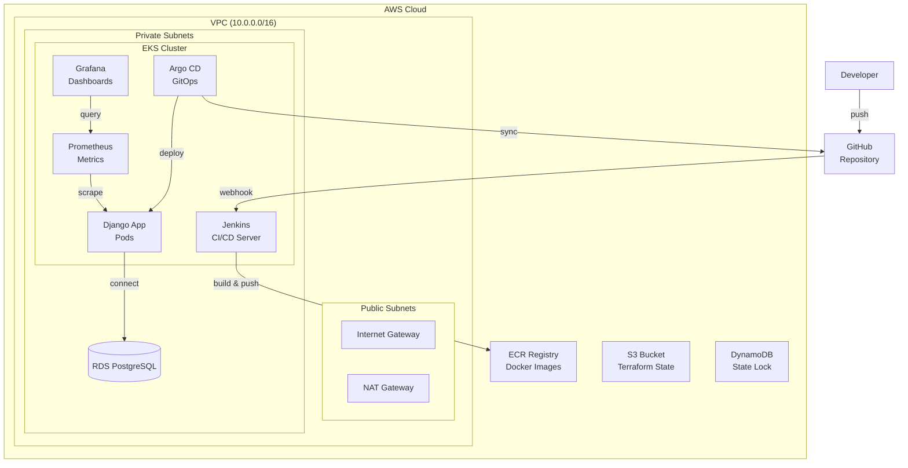

### CI/CD Flow

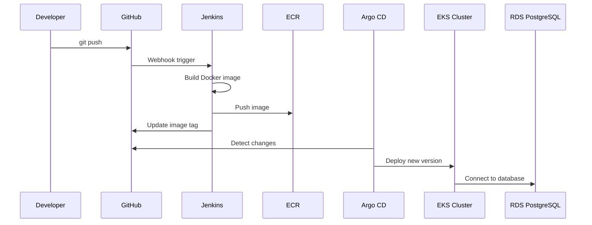

---

## Компоненти

| Компонент | Призначення | Статус |
|-----------|-------------|--------|
| **VPC** | Мережева ізоляція з public/private subnets | ✅ |
| **EKS** | Kubernetes кластер (3 nodes, SPOT) | ✅ |
| **ECR** | Docker registry для Django images | ✅ |
| **RDS** | PostgreSQL база даних (db.t3.micro) | ✅ |
| **Jenkins** | CI/CD сервер з persistence | ✅ |
| **Argo CD** | GitOps deployment | ✅ |
| **Prometheus** | Збір метрик з кластера | ✅ |
| **Grafana** | Візуалізація метрик | ✅ |
| **S3 + DynamoDB** | Terraform state backend | ✅ |

---

## Структура проєкту

```
final-project/
├── main.tf                      # Підключення всіх модулів
├── backend.tf                   # S3 + DynamoDB backend
├── providers.tf                 # AWS, K8s, Helm providers
├── outputs.tf                   # Outputs
├── argocd-application.yaml      # Argo CD Application manifest
│
├── modules/
│   ├── s3-backend/              # S3 + DynamoDB для state
│   ├── vpc/                     # VPC з subnets
│   ├── ecr/                     # Docker registry
│   ├── eks/                     # EKS кластер + EBS CSI driver
│   ├── rds/                     # PostgreSQL база даних
│   ├── jenkins/                 # CI/CD сервер
│   ├── argo-cd/                 # GitOps deployment
│   └── monitoring/              # Prometheus + Grafana
│
├── charts/
│   └── django-app/              # Helm chart для Django
│       ├── Chart.yaml
│       ├── values.yaml
│       └── templates/
│           ├── deployment.yaml
│           ├── service.yaml
│           ├── configmap.yaml
│           └── hpa.yaml
│
└── Django/                      # Django застосунок
    ├── app/
    │   └── main.py
    ├── Dockerfile
    ├── Jenkinsfile              # CI/CD pipeline
    └── requirements.txt
```

---

## Швидкий старт

### Передумови

- AWS CLI налаштований з credentials
- Terraform >= 1.0
- kubectl встановлений
- Helm 3 встановлений

### Крок 1: Клонування репозиторію

```bash
git clone https://github.com/andriy-pro/goit-devops-course.git
cd goit-devops-course
git checkout final-project
```

### Крок 2: Створення S3 Backend

```bash
cd final-project
terraform init
terraform apply -target=module.s3_backend
```

### Крок 3: Налаштування Backend

1. Розкоментувати `backend.tf`
2. Мігрувати state:

```bash
terraform init -migrate-state
```

### Крок 4: Розгортання інфраструктури

⚠️ **УВАГА:** З цього моменту починаються витрати (~$0.20/год)

```bash
terraform plan
terraform apply
```

**Час виконання:** ~25-35 хвилин

### Крок 5: Налаштування kubectl

```bash
aws eks update-kubeconfig --region eu-north-1 --name final-project-eks
kubectl get nodes
```

### Крок 6: Створення RDS Secret

```bash
kubectl create secret generic rds-credentials \
  --from-literal=DB_HOST=$(terraform output -raw rds_endpoint) \
  --from-literal=DB_PORT=5432 \
  --from-literal=DB_NAME=djangodb \
  --from-literal=DB_USER=dbadmin \
  --from-literal=DB_PASSWORD=$(terraform output -raw rds_password) \
  -n default
```

### Крок 7: Застосування Argo CD Application

```bash
kubectl apply -f argocd-application.yaml
```

### Крок 8: Налаштування Jenkins

1. Відкрий Jenkins UI (див. [Доступ до сервісів](#доступ-до-сервісів))
2. Створи credentials:
   - `aws-credentials` (AWS Access Key)
   - `github-token` (GitHub Personal Access Token, тип: **Secret text**)
3. Створи Pipeline job:
   - Type: Pipeline
   - Definition: Pipeline script from SCM
   - Repository: `https://github.com/andriy-pro/goit-devops-course.git`
   - Branch: `*/final-project`
   - Script Path: `final-project/Django/Jenkinsfile`

### Крок 9: Запуск CI/CD Pipeline

1. Відкрий Pipeline job в Jenkins
2. Натисни "Build Now"
3. Після успішного build Argo CD автоматично задеплоїть застосунок

---

## Доступ до сервісів

### Jenkins (CI/CD)

**LoadBalancer URL:**

```
http://<LOADBALANCER_URL>:8080
```

**Або через port-forward:**

```bash
kubectl port-forward svc/jenkins 8080:8080 -n jenkins
```

URL: <http://localhost:8080>

**Дані для входу:**

```bash
# Username:
admin

# Password:
kubectl get secret jenkins -n jenkins -o jsonpath='{.data.jenkins-admin-password}' | base64 -d && echo
```

### Argo CD (GitOps)

**LoadBalancer URL:**

```
http://<LOADBALANCER_URL>
```

**Або через port-forward:**

```bash
kubectl port-forward svc/argocd-server 8081:80 -n argocd
```

URL: <http://localhost:8081>

**Дані для входу:**

```bash
# Username:
admin

# Password:
kubectl -n argocd get secret argocd-initial-admin-secret -o jsonpath="{.data.password}" | base64 -d && echo
```

### Grafana (Моніторинг)

**Port-forward:**

```bash
kubectl port-forward svc/grafana 3000:80 -n monitoring
```

URL: <http://localhost:3000>

**Дані для входу:**

```
Username: admin
Password: goit-2025-grafana
```

### Prometheus (Метрики)

**Port-forward:**

```bash
kubectl port-forward svc/prometheus-server 9090:80 -n monitoring
```

URL: <http://localhost:9090>

### Django застосунок

**LoadBalancer URL:**

```bash
kubectl get svc django-app -n default -o jsonpath='{.status.loadBalancer.ingress[0].hostname}'
```

---

## CI/CD Pipeline

### Опис Pipeline

Jenkins Pipeline (`final-project/Django/Jenkinsfile`) виконує наступні кроки:

1. **Checkout** — клонує код з GitHub
2. **Get ECR Token** — отримує токен для авторизації в ECR
3. **Configure Kaniko Auth** — налаштовує авторизацію для Kaniko
4. **Build & Push Image** — збирає Docker образ і пушить в ECR
5. **Update Helm Values** — оновлює `values.yaml` з новим тегом і пушить в Git

### GitOps Flow

1. Jenkins оновлює `values.yaml` в Git
2. Argo CD виявляє зміни (автоматичний sync)
3. Argo CD застосовує новий образ до Kubernetes
4. Deployment оновлюється з новим образом
5. Поди перезапускаються з новим образом

### Перевірка Pipeline

```bash
# Перевірка образів в ECR
aws ecr describe-images --repository-name final-project-django --region eu-north-1

# Перевірка Deployment
kubectl get deployment django-app -n default

# Перевірка подів
kubectl get pods -l app.kubernetes.io/name=django-app -n default
```

---

## Моніторинг

### Prometheus

Prometheus збирає метрики з:

- Kubernetes nodes
- Kubernetes pods
- Kubernetes API server
- Node Exporter (системні метрики)
- Kube State Metrics (Kubernetes об'єкти)

### Grafana

Grafana підключена до Prometheus як datasource і відображає:

- Kubernetes cluster метрики
- Pod метрики (CPU, Memory)
- Node метрики

### Доступ до метрик

```bash
# Prometheus
kubectl port-forward svc/prometheus-server 9090:80 -n monitoring

# Grafana
kubectl port-forward svc/grafana 3000:80 -n monitoring
```

---

## Можливі проблеми та рішення

### 1. Terraform `-target` Warning

**Проблема:**

```
Warning: Resource targeting is in effect
```

**Причина:** Використання `-target` для створення S3 backend перед міграцією state.

**Рішення:** Це очікувана поведінка. Після створення S3 bucket:

1. Розкоментувати `backend.tf`
2. Виконати `terraform init -migrate-state`

---

### 2. EKS Node Group — Free Tier обмеження

**Проблема:**

```
AsgInstanceLaunchFailures: Could not launch On-Demand Instances.
InvalidParameterCombination - The specified instance type is not eligible for Free Tier.
```

**Причина:** Free Tier не підтримує EKS nodes.

**Рішення:** Використовувати SPOT інстанси:

```hcl
capacity_type  = "SPOT"
instance_types = ["t3.medium", "t3.small"]
```

---

### 3. Helm Release — Context Deadline Exceeded

**Проблема:**

```
Error: context deadline exceeded
with module.monitoring.helm_release.prometheus
```

**Причина:** Helm чекає поки всі поди будуть Ready, але timeout (5 хв) закінчується раніше.

**Рішення:** Додати в `helm_release`:

```hcl
timeout = 600  # 10 хвилин
wait    = false  # Не чекати Ready
```

---

### 4. Prometheus/Grafana — Pod Pending (PVC)

**Проблема:**

```
Warning: FailedScheduling - pod has unbound immediate PersistentVolumeClaims
```

**Причина:** Helm chart за замовчуванням створює PVC, але StorageClass не налаштований.

**Рішення:** Вимкнути persistence в values:

```yaml
server:
  persistentVolume:
    enabled: false

alertmanager:
  enabled: false  # Також потребує PVC
```

---

### 5. Prometheus/Grafana — Pod Pending (Too Many Pods)

**Проблема:**

```
Warning: FailedScheduling - 0/2 nodes are available: 2 Too many pods
```

**Причина:**

- t3.medium має ліміт ~17 pods (ENI limit)
- t3.small має ліміт ~11 pods
- Кластер перевантажений

**Рішення варіант 1:** Збільшити кількість nodes:

```hcl
desired_nodes = 3
min_nodes     = 3
```

**Рішення варіант 2:** Зменшити ресурси для monitoring:

```yaml
# values-prometheus.yaml
server:
  resources:
    requests:
      memory: 128Mi
      cpu: 50m

# values-grafana.yaml
resources:
  requests:
    memory: 64Mi
    cpu: 25m
```

---

### 6. RDS — Reserved Username

**Проблема:**

```
InvalidParameterValue: MasterUsername admin cannot be used as it is a reserved word
```

**Причина:** `admin` — зарезервоване слово для PostgreSQL.

**Рішення:** Використовувати інше ім'я:

```hcl
db_username = "dbadmin"
```

---

### 7. AWS Description — Кирилиця

**Проблема:**

```
"description" doesn't comply with restrictions: "Опис українською"
```

**Причина:** AWS API не підтримує Unicode в полі `description`.

**Рішення:** Використовувати англійську для AWS description:

```hcl
description = "Security group for database"  # Не "Група безпеки"
```

---

### 8. Jenkins — Credentials Type Error

**Проблема:**

```
ERROR: Credentials 'github-token' is of type 'Username with password'
where 'org.jenkinsci.plugins.plaincredentials.StringCredentials' was expected
```

**Причина:** GitHub token створено як "Username with password" замість "Secret text".

**Рішення:**

1. Jenkins → Manage Jenkins → Credentials
2. Видалити `github-token`
3. Створити новий: Kind = **Secret text** (не Username with password)
4. ID = `github-token`
5. Secret = (твій GitHub token)

---

### 9. Jenkins — Втрата даних після перезапуску

**Проблема:** Jenkins втрачає налаштування після перезапуску pod.

**Причина:** Persistence вимкнено.

**Рішення:** Увімкнути persistence в `modules/jenkins/main.tf`:

```hcl
persistence = {
  enabled      = true
  storageClass = "gp2"
  size         = "8Gi"
  accessMode   = "ReadWriteOnce"
}
```

**Примітка:** Потрібен EBS CSI driver (встановлюється автоматично в EKS модулі).

---

### 10. Argo CD — Не відкривається UI

**Проблема:** Argo CD UI не відкривається через port-forward.

**Причина:**

- Неправильний namespace (`argocdocd` замість `argocd`)
- Використання HTTPS (443) замість HTTP (80)

**Рішення:**

```bash
# Правильна команда (HTTP):
kubectl port-forward svc/argocd-server 8081:80 -n argocd

# Або через LoadBalancer:
# http://<LOADBALANCER_URL>
```

---

### 11. Django — ImagePullBackOff

**Проблема:**

```
ImagePullBackOff: image "final-project-django:initial" not found
```

**Причина:** Образ ще не створено в ECR.

**Рішення:**

1. Запустити Jenkins pipeline для створення образу
2. Після успішного build образ з'явиться в ECR
3. Argo CD автоматично синхронізує і задеплоїть

---

### 12. Jenkins Pipeline — Pod Connection Refused

**Проблема:**

```
Refusing headers from remote: Unknown client name: django-app-pipeline-...
```

**Причина:** Pipeline pod завис і не може підключитися до Jenkins.

**Рішення:**

```bash
# Видалити завислі pipeline поди
kubectl delete pod <pipeline-pod-name> -n jenkins

# Перезапустити build в Jenkins
```

---

## Cleanup

⚠️ **ВАЖЛИВО:** Після завершення обов'язково видаліть всі ресурси!

### Крок 1: Видалення через Terraform

```bash
cd final-project

# Спочатку Helm releases (швидко)
terraform destroy -target=module.monitoring
terraform destroy -target=module.argo_cd
terraform destroy -target=module.jenkins

# Потім RDS (довго ~5 хв)
terraform destroy -target=module.rds

# EKS (довго ~10 хв)
terraform destroy -target=module.eks

# VPC та інше
terraform destroy -target=module.vpc -target=module.ecr

# S3 backend (останнім!)
terraform destroy -target=module.s3_backend
```

### Крок 2: Перевірка в AWS Console

- [ ] EKS кластери видалені
- [ ] RDS інстанси видалені
- [ ] VPC видалений
- [ ] S3 bucket видалений
- [ ] ECR репозиторій видалений
- [ ] Load Balancers видалені

### Крок 3: Очищення локальних файлів

```bash
# Видалити Terraform state (якщо не використовується S3 backend)
rm -rf final-project/.terraform
rm -f final-project/terraform.tfstate*
```

---

## Скріншоти

### AWS Console

#### EKS Cluster

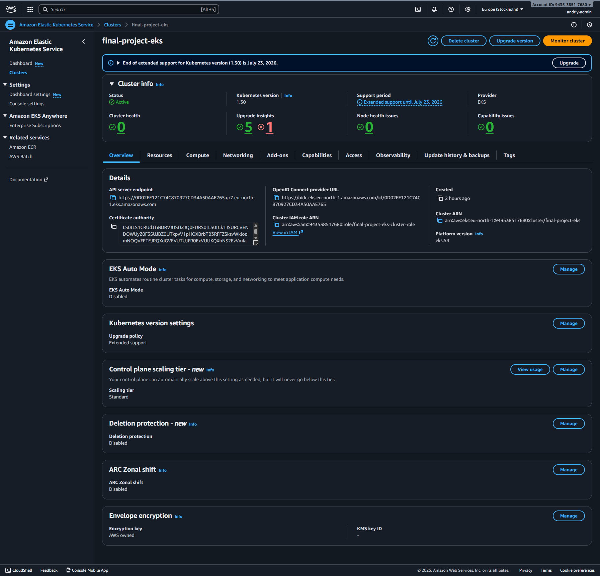

**Що видно:**

- Кластер `final-project-eks`
- Status: Active
- Kubernetes version: 1.30
- Регіон: eu-north-1

#### EKS Networking

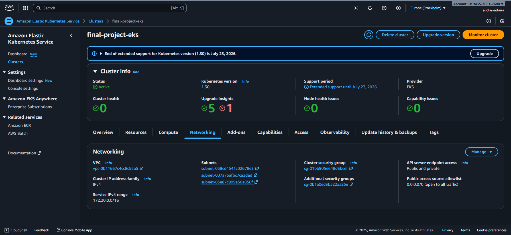

**Що видно:**

- VPC та subnets (public/private)
- Security groups для кластера та nodes
- Status: Active

#### RDS Database

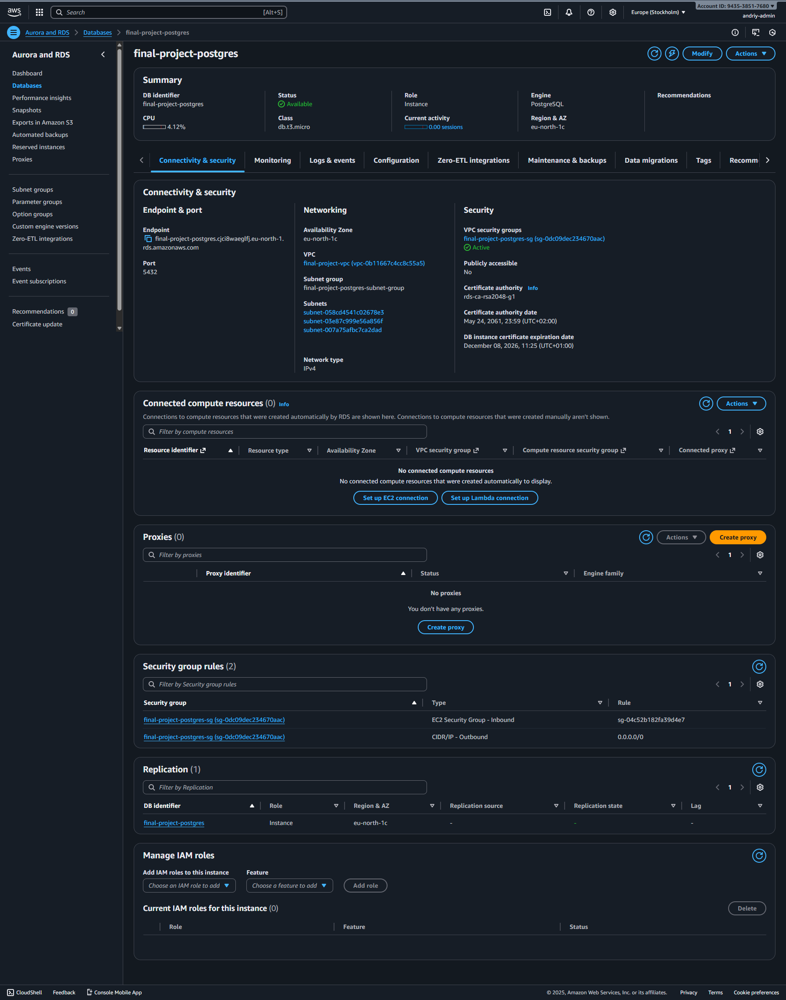

**Що видно:**

- База `final-project-postgres`
- Status: Available
- Engine: PostgreSQL 15.15

#### ECR Repository

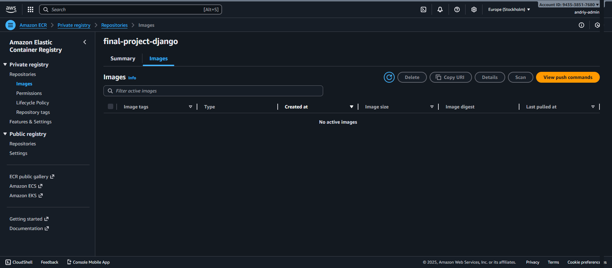

**Що видно:**

- Репозиторій `final-project-django`
- Поки жодних образів

#### ECR Images

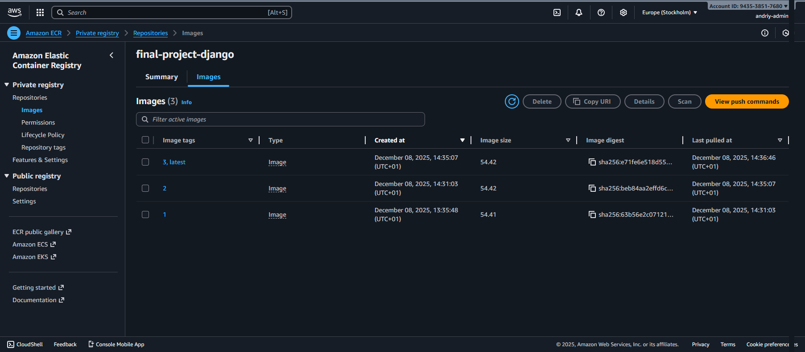

**Що видно:**

- Після кількох збірок образів образи з тегами: 1, 2, 3, latest
- Розміри образів
- Дати створення

---

### Jenkins

#### Jenkins Dashboard

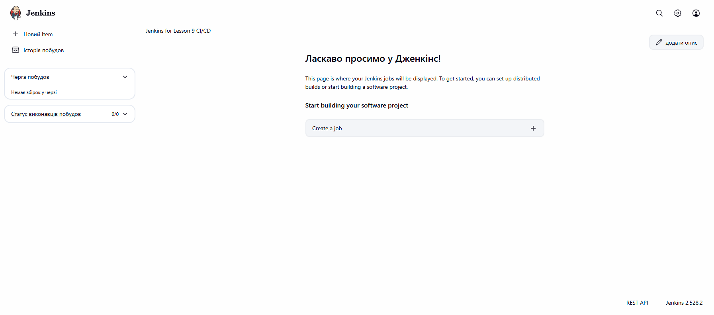

**Що видно:**

- Початковий вигляд Jenkins Dashboard після входу
- Меню зліва: New Item, Build History, Manage Jenkins
- Версія Jenkins внизу сторінки

#### Jenkins Pipeline Success

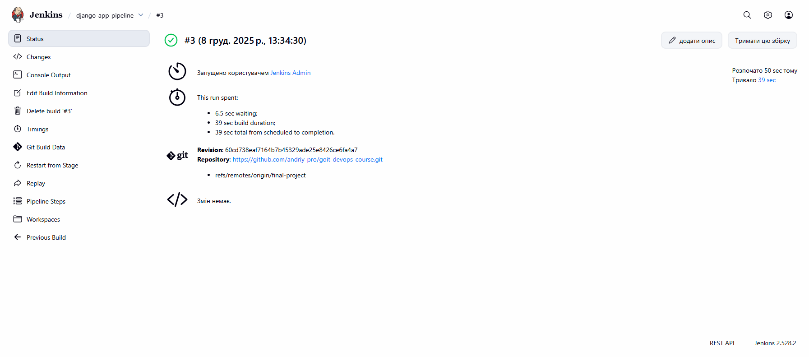

**Що видно:**

- Післяд успішного запуску Pipeline job
- Успішний build (#3)
- Зелена галочка
- Час виконання

---

### Argo CD

#### Argo CD Dashboard

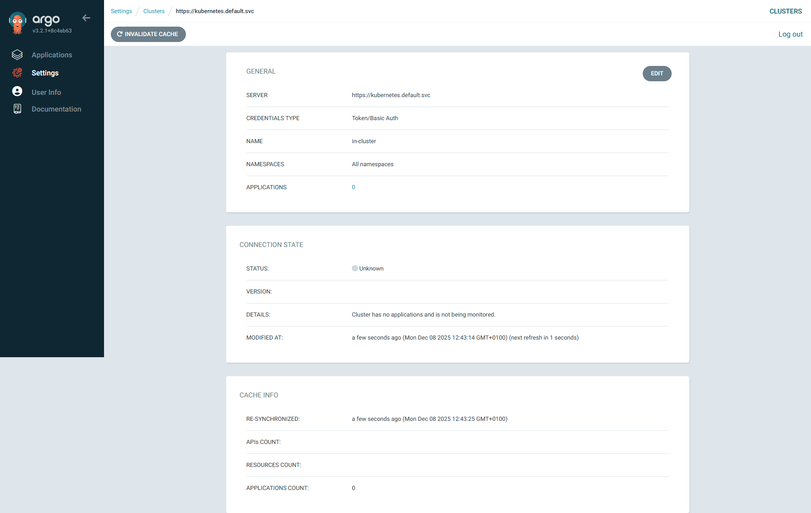

**Що видно:**

- Початковий вигляд Argo CD -> Settings -> Clusters
- Меню зліва: Applications, Settings, User Info
- Статус підключення до кластера

#### Argo CD Synced & Healthy

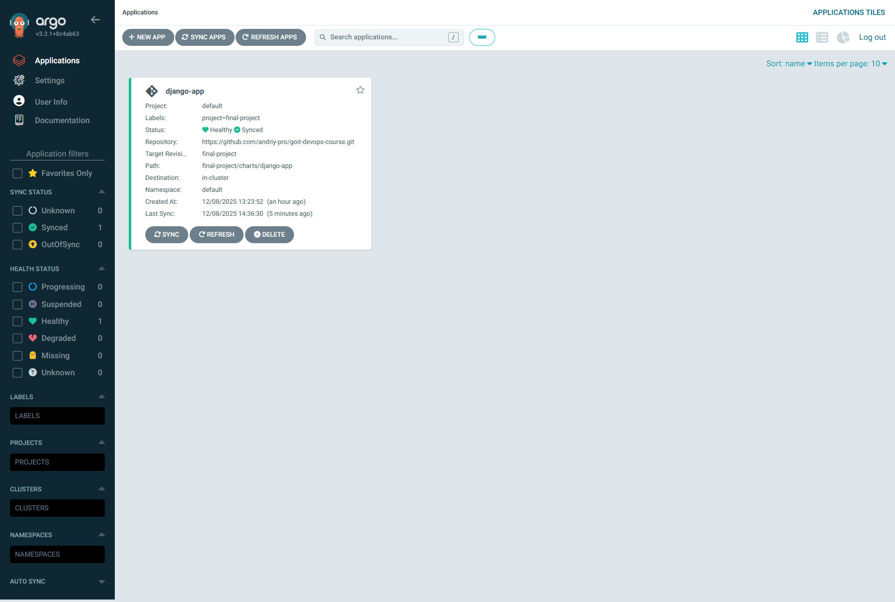

**Що видно:**

- Після успішного деплою Django застосунку
- Application `django-app`
- Status: Synced (зелений)
- Health: Healthy (зелене серце)

---

### Моніторинг

#### Prometheus Home

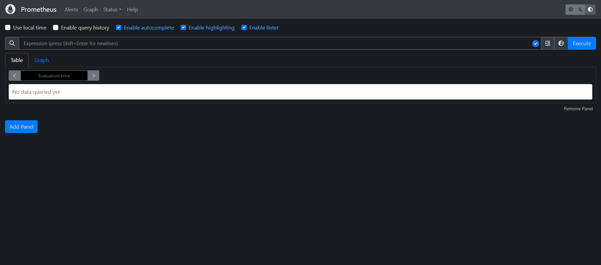

**Що видно:**

- Поле для PromQL запитів
- Меню: Status, Alerts, Graph

#### Prometheus Targets

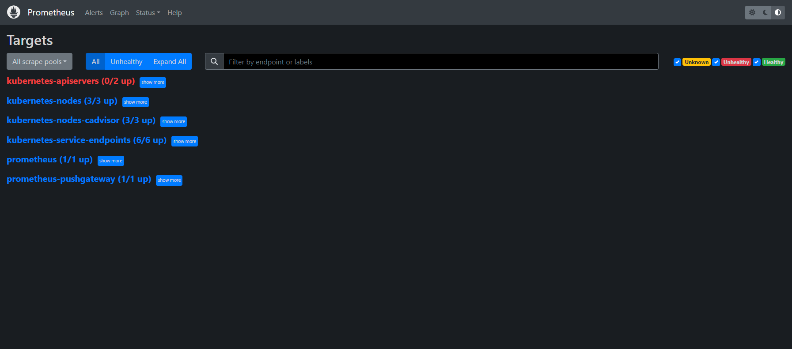

**Що видно:**

- Status → Targets
- Список targets зі статусами (UP/DOWN)
- Kubernetes nodes, pods, API server

#### Grafana Home

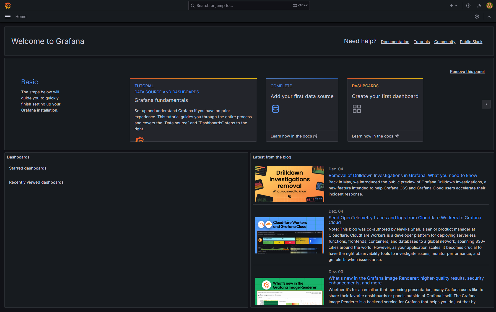

**Що видно:**

- Головна сторінка Grafana після входу

#### Grafana Datasource

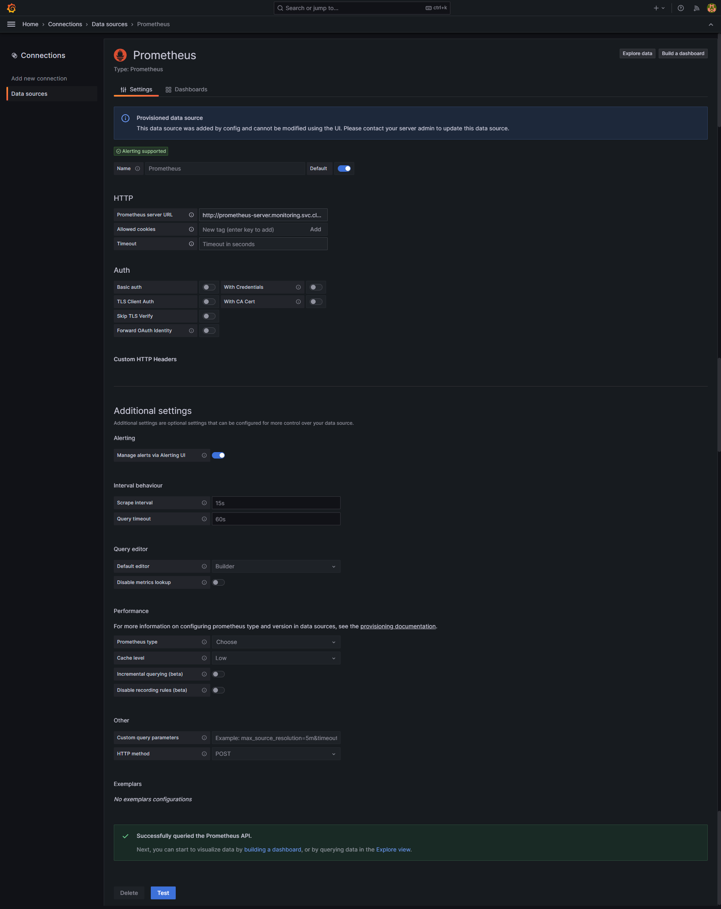

**Що видно:**

- Connections → Data sources → Prometheus
- URL: `http://prometheus-server.monitoring.svc.cluster.local`
- Status: Success (зелений)

---

### Django застосунок

#### Django App Browser

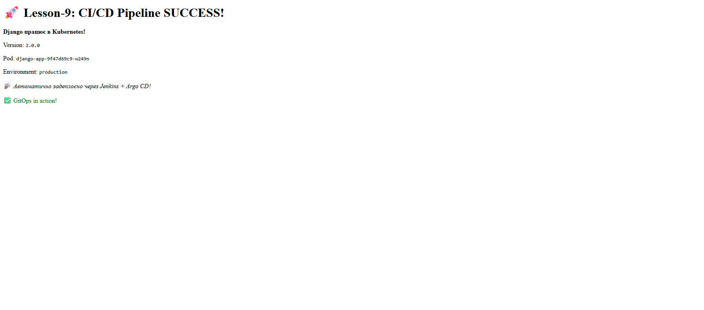

**Що видно:**

- Сторінка Django застосунку
- Текст: "Django працює в Kubernetes!"
- Version: 2.0.0
- Pod name
- Environment variables

---

## Вартість

| Ресурс | Вартість/год | Примітки |
|--------|--------------|----------|
| EKS Control Plane | $0.10 | Фіксована |
| EKS Nodes (3x SPOT) | ~$0.03 | t3.medium + t3.small |
| RDS db.t3.micro | $0.02 | Free Tier eligible |
| NAT Gateway | $0.05 | Фіксована |
| EBS Volumes | ~$0.01 | Jenkins persistence (8Gi) |
| S3 + DynamoDB | ~$0 | Мінімальні витрати |
| **Загалом** | **~$0.21/год** | ~$5/день |

⚠️ **УВАГА:** Після завершення обов'язково виконайте `terraform destroy`!

---

## Висновок

Фінальний проєкт успішно демонструє повну DevOps інфраструктуру на AWS:

✅ **Infrastructure as Code** — Terraform автоматизує створення всіх ресурсів
✅ **CI/CD Pipeline** — Jenkins автоматично збирає та пушить Docker образи
✅ **GitOps** — Argo CD автоматично деплоїть зміни з Git
✅ **Моніторинг** — Prometheus + Grafana збирають та візуалізують метрики
✅ **База даних** — RDS PostgreSQL для зберігання даних
✅ **Масштабованість** — Kubernetes HPA автоматично масштабує застосунок

Всі компоненти працюють разом для створення повноцінного CI/CD pipeline з автоматичним deployment.
