# Lesson 9: CI/CD Pipeline з Jenkins та Argo CD

## Опис проєкту

Повний CI/CD-конвеєр для автоматичної збірки, публікації та розгортання Django
застосунку в Kubernetes з використанням GitOps підходу.

### Компоненти

| Компонент     | Призначення                                            |
| ------------- | ------------------------------------------------------ |
| **Jenkins**   | CI-сервер для автоматичної збірки образів              |
| **Kaniko**    | Збірка Docker образів в Kubernetes (без Docker daemon) |
| **ECR**       | Приватний Docker registry в AWS                        |
| **Argo CD**   | GitOps CD-платформа для автоматичного розгортання      |
| **EKS**       | Managed Kubernetes кластер                             |
| **Helm**      | Пакетний менеджер для Kubernetes                       |
| **Terraform** | Infrastructure as Code                                 |

---

## Архітектура CI/CD

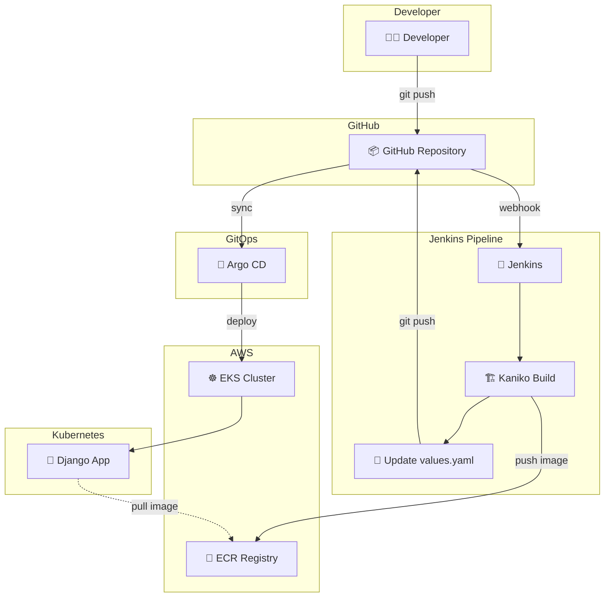

### CI/CD Flow (Sequence)

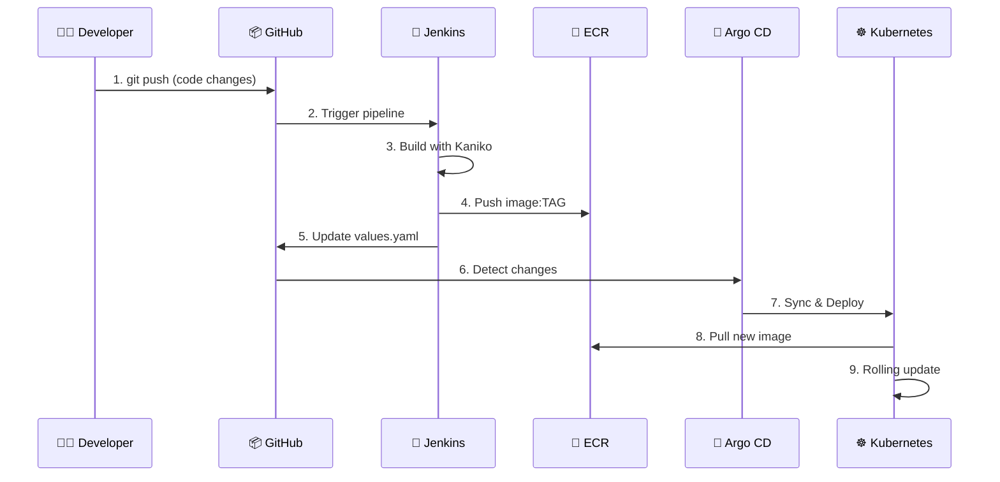

---

## Структура проєкту

```
lesson-9/
├── main.tf                    # Головна конфігурація Terraform
├── backend.tf                 # S3 backend для state
├── outputs.tf                 # Виходи Terraform
├── providers.tf               # Провайдери (AWS, Kubernetes, Helm)
├── variables.tf               # Змінні
├── Dockerfile                 # Docker образ Django
├── Jenkinsfile                # Jenkins CI pipeline
├── requirements.txt           # Python залежності
├── argocd-application.yaml    # Argo CD Application manifest
├── app/
│   └── main.py                # Django застосунок
├── modules/
│   ├── s3-backend/            # S3 + DynamoDB для Terraform state
│   ├── vpc/                   # VPC з public/private subnets
│   ├── ecr/                   # ECR репозиторій
│   ├── eks/                   # EKS кластер
│   ├── jenkins/               # Jenkins Helm release
│   └── argo-cd/               # Argo CD Helm release
└── charts/
    └── django-app/            # Helm chart для Django
        ├── Chart.yaml
        ├── values.yaml        # ← Оновлюється Jenkins
        └── templates/
```

---

## Як застосувати Terraform

### Передумови

```bash
# Перевірка інструментів
terraform version   # >= 1.0
aws --version       # >= 2.0
kubectl version     # >= 1.25
helm version        # >= 3.0
docker --version    # >= 20.0
```

### Крок 1: Підготовка

```bash
# Клонувати репозиторій
git clone https://github.com/andriy-pro/goit-devops-course.git
cd goit-devops-course
git checkout lesson-8-9

# Перейти в директорію
cd lesson-9
```

### Крок 2: Ініціалізація Terraform

```bash
# Ініціалізація (спочатку з локальним backend)
terraform init

# Перевірка конфігурації
terraform validate

# Перегляд плану
terraform plan -out=tfplan
```

### Крок 3: Застосування

> ⚠️ **УВАГА:** Це створить платні ресурси AWS (~$0.30/год)

```bash
terraform apply tfplan
```

**Час виконання:** ~25-30 хвилин

### Крок 4: Налаштування kubectl

```bash
# Оновити kubeconfig
aws eks update-kubeconfig --region eu-north-1 --name lesson-9-eks

# Перевірка
kubectl get nodes
```

Після налаштування в K9s видно всі namespaces:

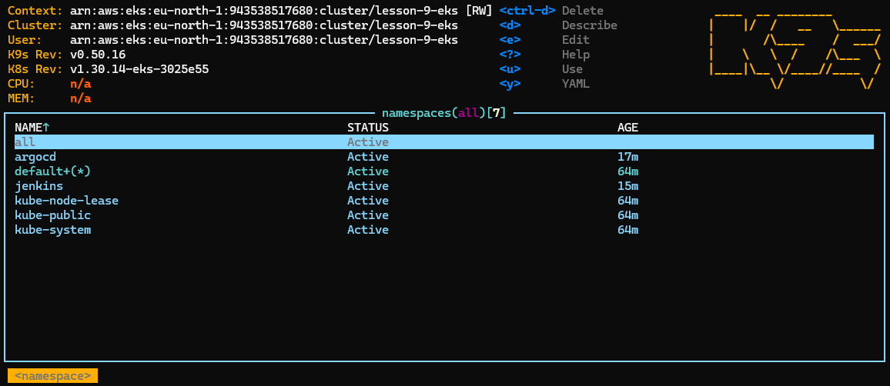

_K9s: namespaces `jenkins`, `argocd`, `django-app`, `kube-system`_

### Крок 5: Отримання credentials

```bash
# Jenkins
echo "Jenkins password: $(terraform output -raw jenkins_admin_password)"
kubectl get svc -n jenkins jenkins -o jsonpath='{.status.loadBalancer.ingress[0].hostname}'

# Argo CD
echo "Argo CD password: $(terraform output -raw argocd_admin_password)"
kubectl get svc -n argocd argocd-server -o jsonpath='{.status.loadBalancer.ingress[0].hostname}'
```

---

## Як перевірити Jenkins Job

### Крок 1: Відкрити Jenkins UI

1. Отримати URL:

   ```bash
   kubectl get svc -n jenkins jenkins -o jsonpath='{.status.loadBalancer.ingress[0].hostname}'
   ```

2. Відкрити в браузері: `http://<URL>:8080`
3. Логін: `admin` / пароль з `terraform output -raw jenkins_admin_password`

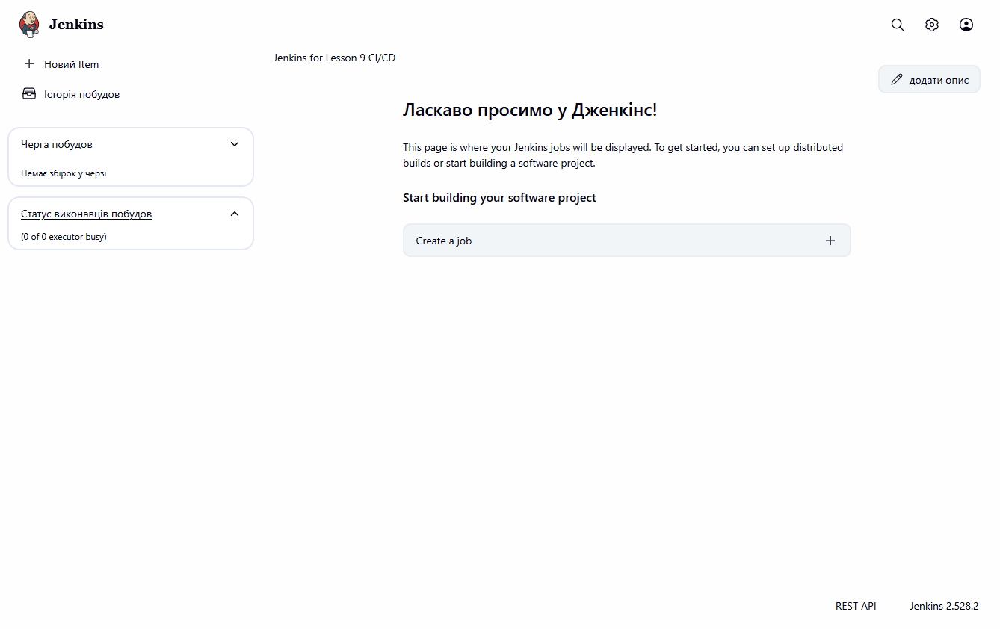

_Jenkins Dashboard після встановлення_

### Крок 2: Додати Credentials

**Manage Jenkins → Credentials → System → Global credentials → Add Credentials**

#### AWS Credentials

- **Kind:** AWS Credentials
- **ID:** `aws-credentials`
- **Access Key ID:** (з `~/.aws/credentials`)
- **Secret Access Key:** (з `~/.aws/credentials`)

#### GitHub Token

- **Kind:** Secret text
- **ID:** `github-token`
- **Secret:** (GitHub Personal Access Token з правами `repo`)

### Крок 3: Створити Pipeline Job

1. **New Item** → назва: `django-app-pipeline` → **Pipeline** → **OK**
2. **Pipeline** section:
   - **Definition:** Pipeline script from SCM
   - **SCM:** Git
   - **Repository URL:** `https://github.com/andriy-pro/goit-devops-course.git`
   - **Branch:** `*/lesson-8-9`
   - **Script Path:** `lesson-9/Jenkinsfile`
3. **Save**

### Крок 4: Запуск Pipeline

1. Натиснути **Build Now**
2. Спостерігати за виконанням в **Console Output**

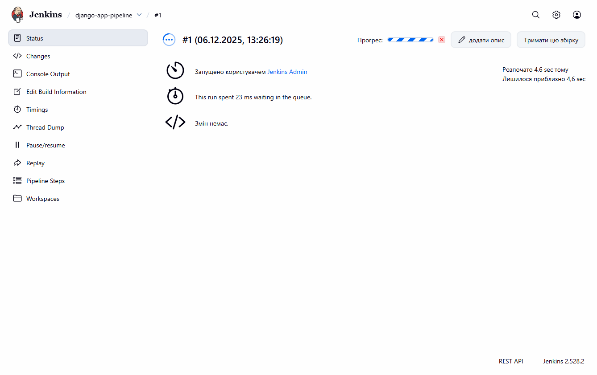

_Pipeline в процесі виконання_

#### Очікувані stages

| Stage                 | Опис                            |
| --------------------- | ------------------------------- |
| Checkout              | Клонування репозиторію          |
| Get ECR Token         | Отримання токена для ECR        |
| Configure Kaniko Auth | Налаштування авторизації Kaniko |
| Build & Push Image    | Збірка і пуш образу в ECR       |
| Update Helm Values    | Оновлення тегу в values.yaml    |

### Перевірка успішності

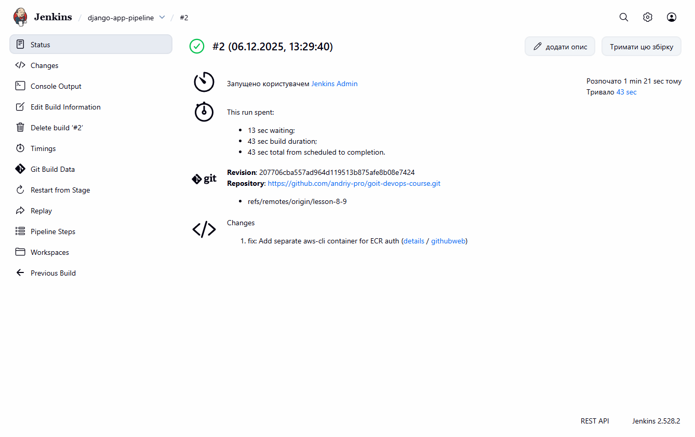

_Pipeline #2 завершено успішно_

```bash
# Перевірити образи в ECR
aws ecr describe-images --repository-name lesson-9-django --region eu-north-1

# Перевірити оновлений values.yaml
git pull origin lesson-8-9
cat lesson-9/charts/django-app/values.yaml | grep -A2 "image:"
```

### Образи в ECR

Після першого push:

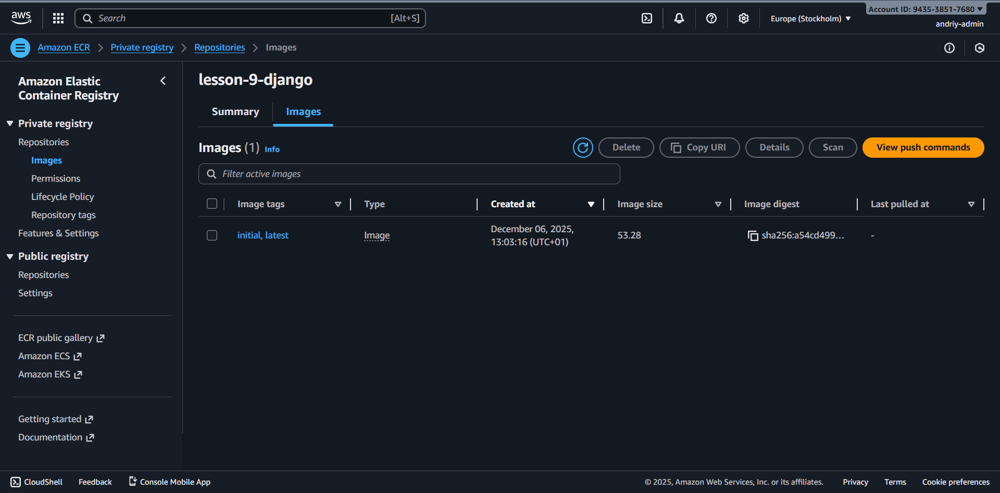

_ECR: один образ з тегами `initial`, `latest`_

Після кількох pipeline builds:

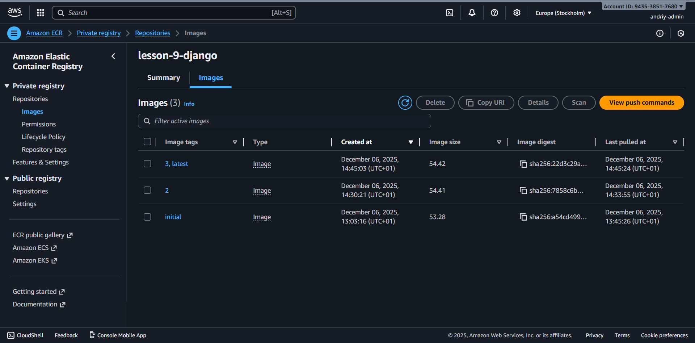

_ECR: три образи з тегами `initial`, `1`, `2`, `3`, `latest`_

---

## Як побачити результат в Argo CD

### Крок 1: Відкрити Argo CD UI

1. Отримати URL:

   ```bash
   kubectl get svc -n argocd argocd-server -o jsonpath='{.status.loadBalancer.ingress[0].hostname}'
   ```

2. Відкрити в браузері: `http://<URL>`
3. Логін: `admin` / пароль з `terraform output -raw argocd_admin_password`

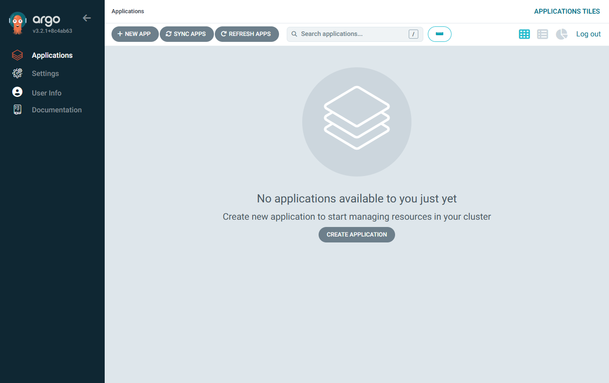

_Argo CD Dashboard після встановлення_

### Крок 2: Перевірити Application

1. Відкрити **Applications** → **django-app**
2. Перевірити статус:
   - **Sync Status:** Synced (зелений)
   - **Health Status:** Healthy (зелене серце)

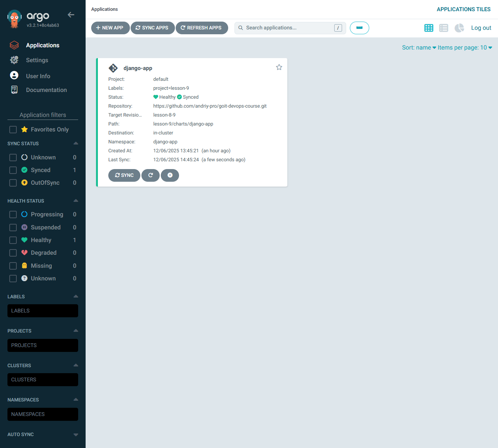

_Argo CD: Application синхронізовано, всі ресурси Healthy_

### Крок 3: Перевірити автоматичне оновлення

Після Jenkins pipeline:

1. Argo CD виявить зміни в Git
2. Автоматично синхронізує
3. Kubernetes виконає rolling update

```bash
# Перевірити поточний образ
kubectl get deployment django-app -n django-app -o jsonpath='{.spec.template.spec.containers[0].image}'

# Перевірити поди
kubectl get pods -n django-app
```

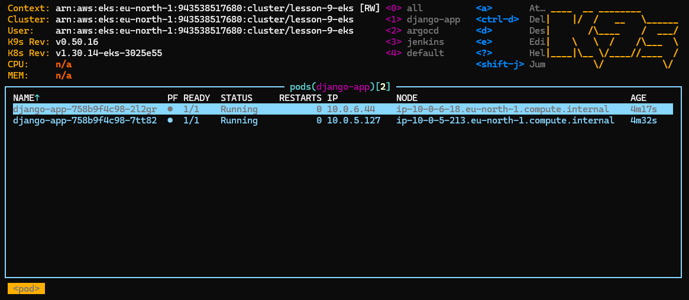

_K9s: 2 поди django-app в статусі Running_

### Крок 4: Перевірити застосунок

```bash
# Отримати URL застосунку
kubectl get svc django-app -n django-app -o jsonpath='{.status.loadBalancer.ingress[0].hostname}'

# Або через curl
APP_URL=$(kubectl get svc django-app -n django-app -o jsonpath='{.status.loadBalancer.ingress[0].hostname}')
curl http://$APP_URL
```

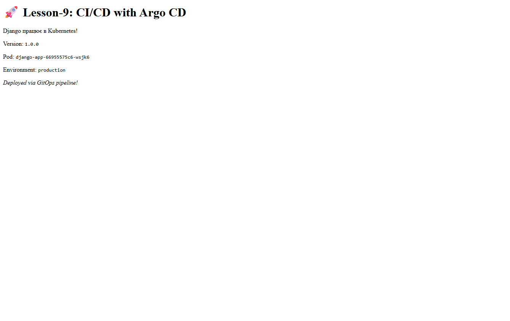

_Django застосунок: Version 1.0.0_

---

## Тестування повного CI/CD циклу

### 1. Внести зміну в код

```bash
# Редагувати app/main.py
# Змінити версію або текст

git add lesson-9/app/main.py
git commit -m "feat: Update app version"
git push origin lesson-8-9
```

### 2. Запустити Jenkins Pipeline

1. Jenkins → django-app-pipeline → Build Now
2. Дочекатися завершення (SUCCESS)

### 3. Перевірити результат

```bash
# ECR - новий образ
aws ecr describe-images --repository-name lesson-9-django --region eu-north-1 | jq '.imageDetails[].imageTags'

# Argo CD - синхронізовано
kubectl get applications -n argocd

# Застосунок - оновлено
curl http://$APP_URL
```

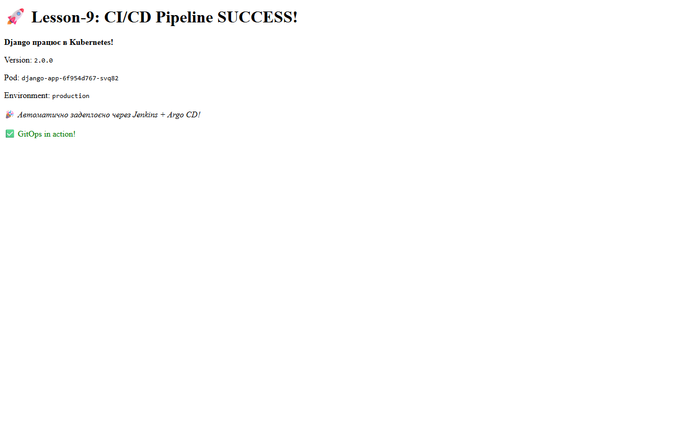

_Django застосунок оновлено: Version 2.0.0 — GitOps in action!_

---

## Корисні команди

### Terraform

```bash
terraform output                          # Всі виходи
terraform output -raw jenkins_admin_password  # Пароль Jenkins
terraform output -raw argocd_admin_password   # Пароль Argo CD
terraform destroy                         # Видалення всіх ресурсів
```

### kubectl

```bash
kubectl get pods -A                       # Всі поди
kubectl get pods -n jenkins               # Поди Jenkins
kubectl get pods -n argocd                # Поди Argo CD
kubectl get pods -n django-app            # Поди застосунку
kubectl get svc -A                        # Всі сервіси
kubectl logs -n jenkins -l app.kubernetes.io/name=jenkins  # Логи Jenkins
```

### K9s (рекомендовано)

```bash
k9s                 # Запуск
:ns                 # Перегляд namespaces
:pods               # Всі поди
:pods jenkins       # Поди в namespace jenkins
:svc                # Сервіси
:apps argocd        # Argo CD Applications
```

### AWS CLI

```bash
aws eks list-clusters                     # Список кластерів
aws ecr describe-repositories             # ECR репозиторії
aws ecr describe-images --repository-name lesson-9-django --region eu-north-1
```

---

## Cleanup (ОБОВ'ЯЗКОВО!)

> ⚠️ **ВАЖЛИВО:** Після завершення роботи видаліть ресурси, щоб уникнути витрат!

```bash
# 1. Видалити Argo CD Application
kubectl delete application django-app -n argocd

# 2. Видалити Django deployment (якщо існує)
kubectl delete deployment django-app -n django-app 2>/dev/null || true
kubectl delete svc django-app -n django-app 2>/dev/null || true

# 3. Terraform destroy
cd lesson-9
terraform destroy

# 4. Перевірити, що всі ресурси видалені
aws eks list-clusters
aws ec2 describe-addresses --query 'Addresses[?AssociationId==`null`]'
aws ec2 describe-nat-gateways --filter "Name=state,Values=available"
```

---

## Вартість

| Компонент               | Вартість/год        |
| ----------------------- | ------------------- |
| EKS Control Plane       | $0.10               |
| EC2 SPOT (t3.medium x2) | ~$0.02-0.04         |
| NAT Gateway             | $0.045              |
| Load Balancers (x3)     | $0.075              |
| **РАЗОМ**               | **~$0.25-0.30/год** |

**Рекомендація:** Виконуйте cleanup одразу після тестування!

---

## Автор

Lesson 9 — CI/CD Pipeline з Jenkins та Argo CD
GoIT DevOps Course
