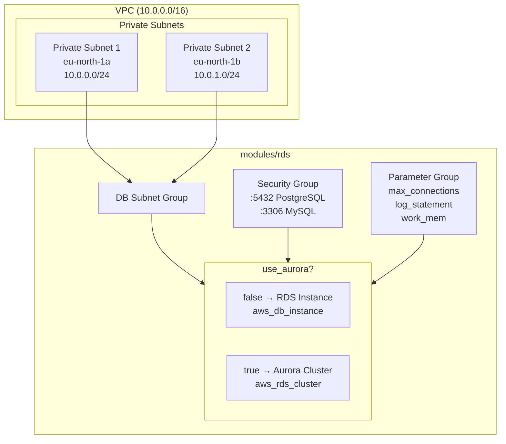
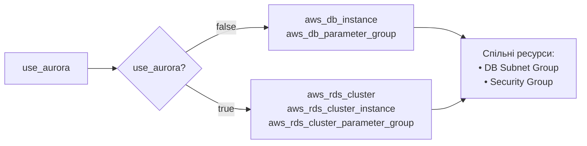
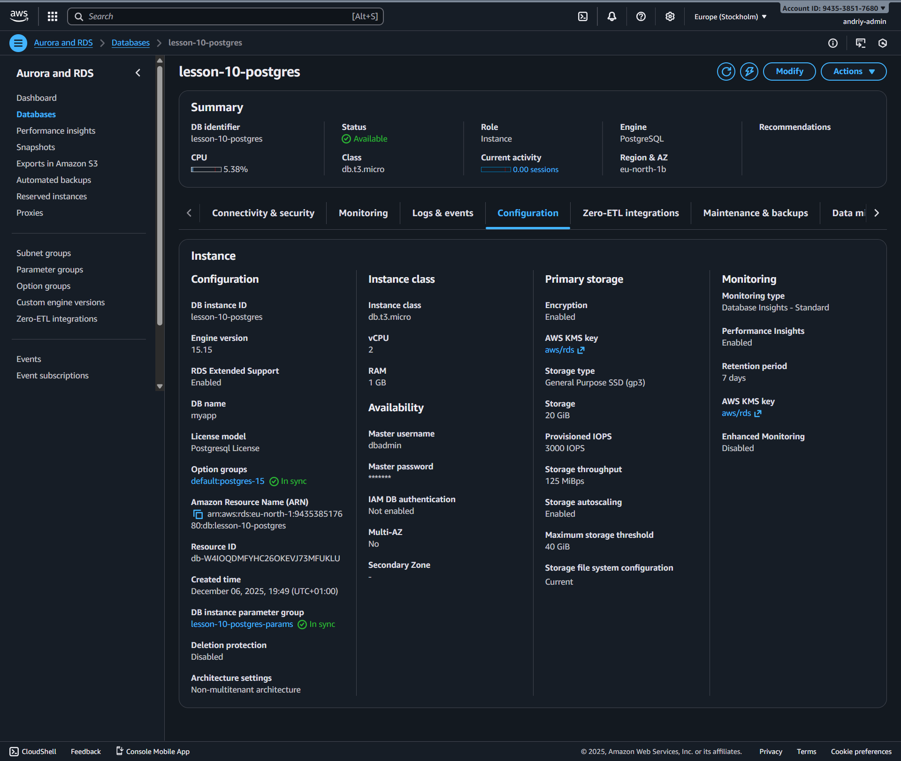
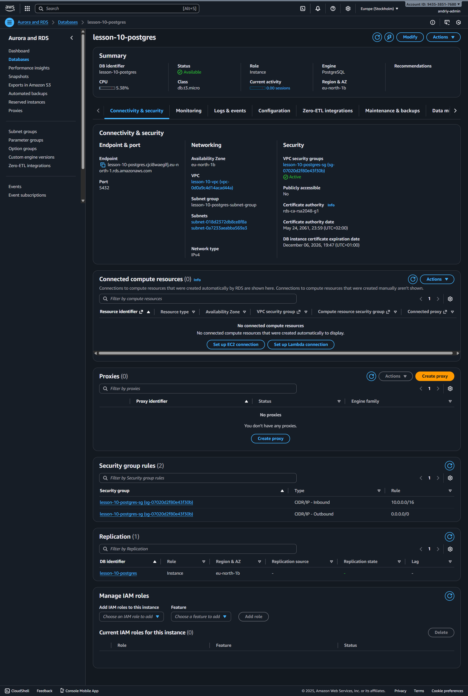

# Урок 10: Гнучкий Terraform-модуль для баз даних

Універсальний Terraform-модуль `rds` для створення AWS RDS Instance або Aurora
Cluster з автоматичним створенням DB Subnet Group, Security Group та Parameter
Group.

## Архітектура



### Логіка умовного створення



## Структура проєкту

```
goit-devops-course/
├── README.md                    # Документація (цей файл)
├── assets/
│   └── screenshots/             # Скріншоти тестування
│       ├── aws-rds-console-1.png
│       └── aws-rds-console-2.png
└── lesson-10/
    ├── main.tf                  # Приклад використання модуля
    ├── providers.tf             # AWS provider
    ├── outputs.tf               # Outputs
    └── modules/
        ├── vpc/                 # Мінімальний VPC
        │   ├── main.tf
        │   ├── variables.tf
        │   └── outputs.tf
        └── rds/                 # Головний модуль
            ├── rds.tf           # RDS Instance (use_aurora=false)
            ├── aurora.tf        # Aurora Cluster (use_aurora=true)
            ├── shared.tf        # Subnet Group, Security Group, Parameter Group
            ├── variables.tf     # Всі змінні з типами та описами
            └── outputs.tf       # Outputs модуля
```

## Швидкий старт

### 1. Ініціалізація

```bash
cd lesson-10
terraform init
```

### 2. Перевірка плану

```bash
terraform plan
```

### 3. Застосування (ПЛАТНО!)

> ⚠️ **УВАГА:** RDS коштує ~$0.02/год для db.t3.micro

```bash
terraform apply
```

### 4. Отримання credentials

```bash
# Endpoint
terraform output rds_endpoint

# Password
terraform output -raw rds_password
```

### 5. Cleanup (ОБОВ'ЯЗКОВО!)

```bash
terraform destroy
```

## Приклади використання модуля

### RDS Instance (PostgreSQL)

```hcl
module "rds" {
  source = "./modules/rds"

  identifier     = "my-postgres"
  use_aurora     = false          # RDS Instance
  engine         = "postgres"
  engine_version = "15.15"        # актуальна версія
  instance_class = "db.t3.micro"
  multi_az       = false

  db_name     = "myapp"
  db_username = "dbadmin"         # НЕ "admin" - зарезервоване слово

  vpc_id     = module.vpc.vpc_id
  subnet_ids = module.vpc.private_subnet_ids

  allowed_cidr_blocks = ["10.0.0.0/16"]

  # Налаштування Parameter Group
  max_connections = 100
  log_statement   = "ddl"
  work_mem        = 4096
}
```

### Aurora Cluster (PostgreSQL)

> ⚠️ **Примітка:** AWS Free Tier акаунти мають обмеження на Aurora.

```hcl
module "rds" {
  source = "./modules/rds"

  identifier     = "my-aurora"
  use_aurora     = true                # Aurora Cluster
  engine         = "aurora-postgresql"
  engine_version = "15.4"              # Aurora має свої версії
  instance_class = "db.t3.medium"      # Aurora мінімум t3.medium
  multi_az       = true                # Створить reader instance

  db_name     = "myapp"
  db_username = "dbadmin"

  vpc_id     = module.vpc.vpc_id
  subnet_ids = module.vpc.private_subnet_ids
}
```

### MySQL RDS

```hcl
module "rds" {
  source = "./modules/rds"

  identifier     = "my-mysql"
  use_aurora     = false
  engine         = "mysql"
  engine_version = "8.0.35"
  instance_class = "db.t3.micro"

  db_name     = "myapp"
  db_username = "dbadmin"

  vpc_id     = module.vpc.vpc_id
  subnet_ids = module.vpc.private_subnet_ids
}
```

## Опис змінних

### Основні

| Змінна              | Тип    | За замовч.    | Опис                                                                        |
| ------------------- | ------ | ------------- | --------------------------------------------------------------------------- |
| `use_aurora`        | bool   | `false`       | `true` = Aurora Cluster, `false` = RDS Instance                             |
| `identifier`        | string | —             | Унікальний ідентифікатор БД в AWS                                           |
| `engine`            | string | `postgres`    | Engine: `postgres`, `mysql`, `mariadb`, `aurora-postgresql`, `aurora-mysql` |
| `engine_version`    | string | `15.15`       | Версія engine (напр. 15.15 для PostgreSQL)                                  |
| `instance_class`    | string | `db.t3.micro` | Клас інстансу. Для Aurora мінімум `db.t3.medium`                            |
| `allocated_storage` | number | `20`          | Розмір сховища в GB (тільки для RDS, Aurora автомасштабується)              |
| `multi_az`          | bool   | `false`       | Висока доступність (standby в іншій AZ)                                     |

### База даних

| Змінна        | Тип    | За замовч. | Опис                                                                 |
| ------------- | ------ | ---------- | -------------------------------------------------------------------- |
| `db_name`     | string | —          | Назва бази даних для створення                                       |
| `db_username` | string | `dbadmin`  | Master username. **НЕ використовуйте `admin`** — зарезервоване слово |
| `db_password` | string | `null`     | Master password. Якщо `null` — генерується автоматично               |

### Мережа

| Змінна                    | Тип          | За замовч. | Опис                                               |
| ------------------------- | ------------ | ---------- | -------------------------------------------------- |
| `vpc_id`                  | string       | —          | ID VPC для Security Group                          |
| `subnet_ids`              | list(string) | —          | Список приватних підмереж (мінімум 2 для Multi-AZ) |
| `allowed_security_groups` | list(string) | `[]`       | Security Groups, яким дозволено доступ             |
| `allowed_cidr_blocks`     | list(string) | `[]`       | CIDR блоки, яким дозволено доступ                  |

### Parameter Group

| Змінна            | Тип    | За замовч. | Опис                                       |
| ----------------- | ------ | ---------- | ------------------------------------------ |
| `max_connections` | number | `100`      | Максимальна кількість з'єднань             |
| `log_statement`   | string | `none`     | Логування SQL: `none`, `ddl`, `mod`, `all` |
| `work_mem`        | number | `4096`     | Пам'ять для операцій сортування (KB)       |

### Backup та захист

| Змінна                    | Тип    | За замовч. | Опис                                               |
| ------------------------- | ------ | ---------- | -------------------------------------------------- |
| `backup_retention_period` | number | `7`        | Днів зберігання автоматичних бекапів               |
| `skip_final_snapshot`     | bool   | `true`     | Пропустити snapshot при видаленні (`true` для dev) |
| `deletion_protection`     | bool   | `false`    | Захист від випадкового видалення (`true` для prod) |

## Outputs

| Output              | Опис                                          |
| ------------------- | --------------------------------------------- |
| `endpoint`          | Endpoint для підключення (host:port)          |
| `reader_endpoint`   | Reader endpoint (тільки Aurora)               |
| `port`              | Порт БД (5432 для PostgreSQL, 3306 для MySQL) |
| `db_name`           | Назва бази даних                              |
| `db_username`       | Master username                               |
| `db_password`       | Master password (sensitive)                   |
| `security_group_id` | ID Security Group                             |
| `connection_string` | Connection string для підключення             |

## Як змінити тип БД

### З RDS на Aurora

1. Змінити `use_aurora = true`
2. Змінити `engine` на `aurora-postgresql` або `aurora-mysql`
3. Змінити `instance_class` мінімум на `db.t3.medium`

```hcl
use_aurora     = true
engine         = "aurora-postgresql"
instance_class = "db.t3.medium"
```

### Змінити engine (PostgreSQL → MySQL)

```hcl
engine         = "mysql"
engine_version = "8.0.35"
```

### Змінити instance class (Dev → Prod)

```hcl
instance_class = "db.r6g.large"
multi_az       = true
```

## Особливості реалізації

- **RDS** створює: `aws_db_instance` + `aws_db_parameter_group`
- **Aurora** створює: `aws_rds_cluster` + `aws_rds_cluster_instance` +
  `aws_rds_cluster_parameter_group`
- Порт визначається автоматично: PostgreSQL = 5432, MySQL = 3306
- Password генерується автоматично якщо не задано

---

## Результати тестування

### Підсумок

| Компонент                 | Статус       | Примітки                                 |
| ------------------------- | ------------ | ---------------------------------------- |
| RDS PostgreSQL Instance   | ✅ Успішно   | Створено та видалено                     |
| Aurora PostgreSQL Cluster | ⚠️ Обмеження | AWS Free Tier не підтримує               |
| DB Subnet Group           | ✅ Успішно   | Автоматично створюється                  |
| Security Group            | ✅ Успішно   | Автоматично створюється                  |
| Parameter Group           | ✅ Успішно   | max_connections, log_statement, work_mem |

### Тест RDS PostgreSQL

**Конфігурація:**

```hcl
module "rds_postgres" {
  source         = "./modules/rds"
  identifier     = "lesson-10-postgres"
  use_aurora     = false
  engine         = "postgres"
  engine_version = "15.15"
  instance_class = "db.t3.micro"
  db_name        = "myapp"
  db_username    = "dbadmin"
  max_connections = 100
  log_statement   = "ddl"
  work_mem        = 4096
}
```

**Результат:**

- `terraform apply`: ✅ Успішно (10 ресурсів)
- Час створення: ~8-10 хвилин
- `terraform destroy`: ✅ Успішно

### Скріншоти AWS Console

#### RDS Databases — Список інстансів



**Що видно:**

- Інстанс `lesson-10-postgres`
- Status: Available
- Engine: PostgreSQL 15.15
- Instance class: db.t3.micro

#### RDS Instance — Деталі



**Що видно:**

- Endpoint для підключення
- Security Group: lesson-10-postgres-sg
- Subnet Group: lesson-10-postgres-subnet-group

### Тест Aurora (обмеження Free Tier)

- `terraform validate`: ✅ Успішно
- `terraform plan`: ✅ Показав правильні ресурси
- `terraform apply`: ❌ FreeTierRestrictionError

**Висновок:** Модуль працює правильно — обмеження на стороні AWS Free Tier.

### Виправлені проблеми

| Проблема                             | Рішення                                  |
| ------------------------------------ | ---------------------------------------- |
| PostgreSQL 15.4 недоступна           | Оновлено до 15.15                        |
| `admin` — зарезервоване слово        | Змінено на `dbadmin`                     |
| Кирилиця в AWS description           | Використано англійську                   |
| max_connections — статичний параметр | Додано `apply_method = "pending-reboot"` |

---

## Вартість

| Ресурс              | Вартість/год |
| ------------------- | ------------ |
| RDS db.t3.micro     | ~$0.02       |
| Aurora db.t3.medium | ~$0.08       |
| VPC (без NAT)       | $0           |

⚠️ **УВАГА:** Після тестування **ОБОВ'ЯЗКОВО** виконайте `terraform destroy`!
