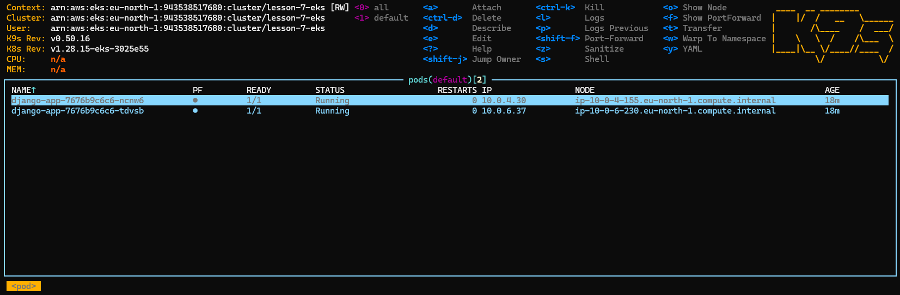
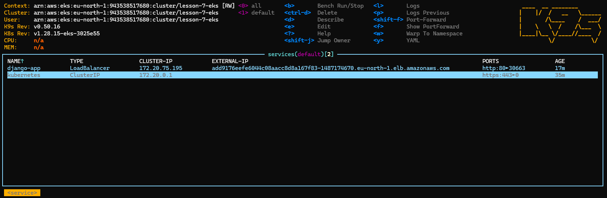
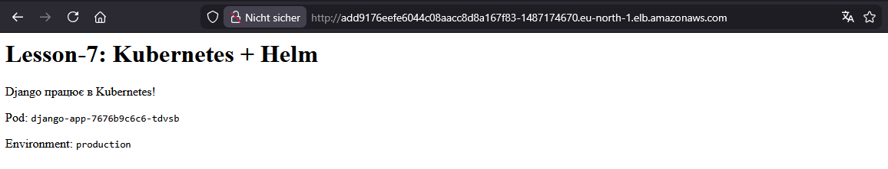
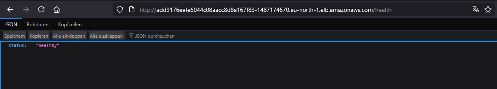
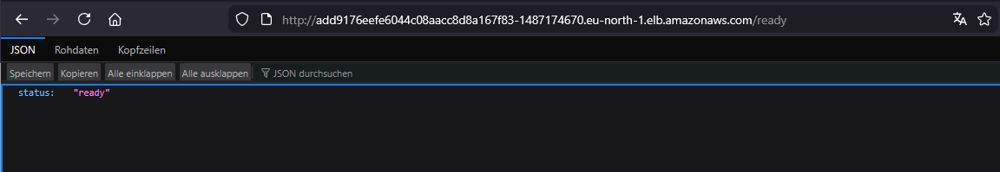
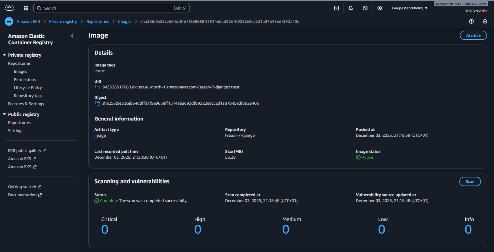
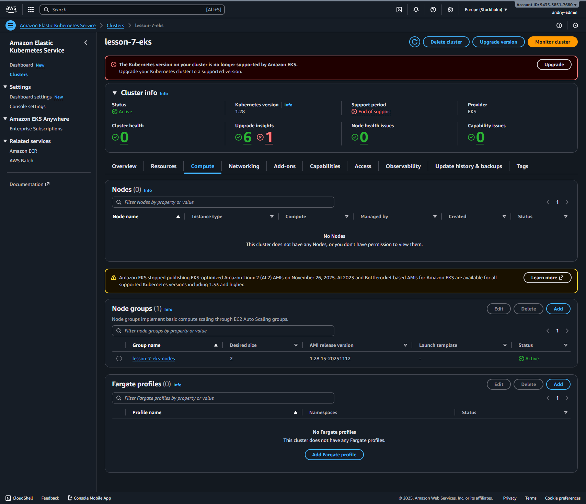
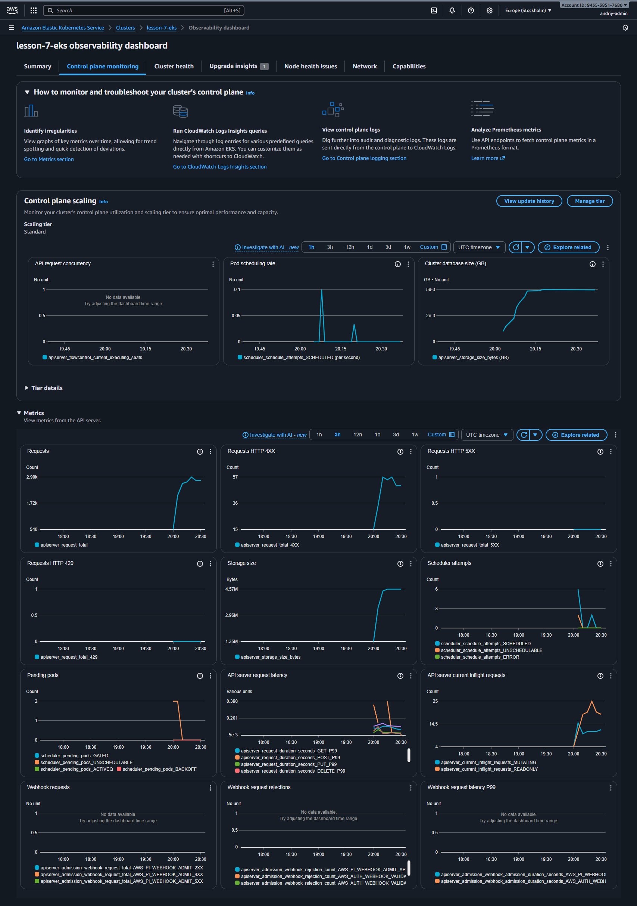

# Lesson 7: Kubernetes (EKS) + Helm

Terraform + Helm проєкт для розгортання Django-застосунку в AWS EKS:

- **EKS** — керований Kubernetes кластер від AWS
- **ECR** — приватний Docker registry для образів
- **Helm Chart** — пакет для deployment з HPA, ConfigMap, Service
- **VPC** — ізольована мережа (перевикористання з lesson-5)

## Структура проєкту

```
lesson-7/
├── main.tf              # Підключення модулів
├── backend.tf           # S3 backend (спочатку закоментований!)
├── outputs.tf           # Вихідні значення
├── providers.tf         # AWS + Kubernetes + Helm providers
├── Dockerfile           # Docker образ Django
├── requirements.txt     # Python залежності
├── app/
│   └── main.py          # Django застосунок з health endpoints
├── modules/
│   ├── s3-backend/      # S3 bucket + DynamoDB table
│   ├── vpc/             # VPC з EKS тегами для subnet discovery
│   ├── ecr/             # ECR repository
│   └── eks/             # EKS Cluster + Node Group
└── charts/
    └── django-app/
        ├── Chart.yaml
        ├── values.yaml
        └── templates/
            ├── _helpers.tpl
            ├── deployment.yaml
            ├── service.yaml
            ├── configmap.yaml
            └── hpa.yaml
```

## Git

Робота ведеться в гілці `lesson-7` (створена від `lesson-5`):

```bash
git checkout lesson-5
git checkout -b lesson-7
```

## Швидкий старт

### 1. Підготовка

```bash
# Перевірка інструментів
terraform version   # >= 1.0
aws --version       # >= 2.0
kubectl version     # >= 1.25
helm version        # >= 3.0
docker --version    # >= 20.0

# Перевірка авторизації AWS
aws sts get-caller-identity
```

### 2. Deploy інфраструктури

```bash
cd lesson-7

# Ініціалізація
terraform init

# Перегляд плану
terraform plan

# Створення ресурсів (⚠️ ~15-20 хвилин, EKS створюється довго)
terraform apply
# Введи: yes
```

### 3. Налаштування kubectl

```bash
# Команда з outputs
aws eks update-kubeconfig --region eu-north-1 --name lesson-7-eks

# Перевірка
kubectl get nodes
```

### 4. Push Docker образу в ECR

```bash
# ECR URL з terraform output
ECR_URL=$(terraform output -raw ecr_repository_url)

# Логін в ECR
aws ecr get-login-password --region eu-north-1 | \
  docker login --username AWS --password-stdin ${ECR_URL%/*}

# Build та push
docker build -t django-app:latest .
docker tag django-app:latest $ECR_URL:latest
docker push $ECR_URL:latest
```

### 5. Deploy Helm Chart

```bash
ECR_URL=$(terraform output -raw ecr_repository_url)

helm install django-app ./charts/django-app \
  --set image.repository=$ECR_URL \
  --set image.tag=latest

# Перевірка
kubectl get pods
kubectl get svc
kubectl get hpa
```

### 6. Отримання URL застосунку

```bash
# Почекати ~2-3 хвилини на LoadBalancer
kubectl get svc django-app -w

# Отримати URL
kubectl get svc django-app -o jsonpath='{.status.loadBalancer.ingress[0].hostname}'
```

### 7. Видалення ресурсів

> ⚠️ **ВАЖЛИВО:** EKS + NAT Gateway коштують ~$5/день. Видаляй одразу після
> тестування!

```bash
# 1. Видалити Helm release
helm uninstall django-app

# 2. Видалити образ з ECR
aws ecr batch-delete-image \
  --repository-name lesson-7-django \
  --image-ids imageTag=latest

# 3. Видалити інфраструктуру
terraform destroy
```

## Типові помилки та їх вирішення

### 1. "Character sets beyond ASCII are not supported"

**Симптом:**

```
Error: InvalidParameterValue: Value (Група безпеки для EKS кластера) for parameter GroupDescription is invalid.
```

**Причина:** AWS **не підтримує Unicode/кирилицю** в полі `description` для
Security Groups.

**Рішення:** Використовуй тільки ASCII символи в `description`:

> 💡 Коментарі в коді (`#`) та `tags` можуть бути українською, але `description`
> — ні!

### 2. "AccessDenied: iam:CreateRole"

**Симптом:**

```
Error: User is not authorized to perform: iam:CreateRole
```

**Причина:** IAM користувач не має прав на створення IAM ролей для EKS.

**Рішення:** Додай політику в AWS Console:

1. IAM → Users → твій користувач
2. Add permissions → Attach policies directly
3. Додай `IAMFullAccess` (або custom policy з `iam:CreateRole`,
   `iam:AttachRolePolicy`)

### 3. "NoSuchBucket" при terraform apply/destroy

**Симптом:**

```
Error: failed to upload state: api error NoSuchBucket: The specified bucket does not exist
```

**Причина:** S3 backend розкоментований, але bucket ще не створено (або вже
видалено).

**Рішення:**

```bash
# 1. Закоментуй backend "s3" {...} в backend.tf

# 2. Видали локальні state файли
rm -f errored.tfstate terraform.tfstate terraform.tfstate.backup

# 3. Очисти .terraform
rm -rf .terraform

# 4. Переініціалізуй
terraform init
```

**Правильний порядок роботи з S3 backend:**

1. `backend.tf` **закоментований** → `terraform apply` (створює S3)
2. `backend.tf` **розкоментований** → `terraform init -migrate-state`

### 4. K9s показує "Context: n/a"

**Симптом:**

```
Context: n/a
Cluster: n/a
User:    n/a
```

**Причина:** Кластер ще не створено, або kubectl не налаштований.

**Рішення:** K9s запрацює **після**:

```bash
# 1. Створення кластера
terraform apply

# 2. Налаштування kubectl
aws eks update-kubeconfig --region eu-north-1 --name lesson-7-eks

# 3. Тепер K9s працюватиме
k9s
```

### 5. "Kubernetes version is no longer supported"

**Симптом:** Попередження в AWS Console про deprecated версію.

**Причина:** Версія 1.28 End of Support (з листопада 2024).

**Рішення:** Для навчального проєкту — **ігнорувати**. Кластер працює нормально.

Для production — оновити версію в `modules/eks/variables.tf`:

```hcl
variable "kubernetes_version" {
  default = "1.30"  # Замість 1.28
}
```

### 6. "ImagePullBackOff" — Pod не може завантажити образ

**Симптом:**

```bash
kubectl get pods
# STATUS: ImagePullBackOff
```

**Причина:** Образ не існує в ECR, або ECR URL неправильний.

**Рішення:**

```bash
# 1. Перевір образи в ECR
aws ecr describe-images --repository-name lesson-7-django

# 2. Перевір ECR URL в helm values
helm get values django-app

# 3. Якщо образу немає — запуш
docker push $ECR_URL:latest
```

## Корисні команди

### kubectl

```bash
kubectl get nodes              # Список worker nodes
kubectl get pods               # Список pods
kubectl get svc                # Список services
kubectl get hpa                # Статус автоскейлера
kubectl logs <pod-name>        # Логи pod
kubectl describe pod <name>    # Детальна інфо
kubectl exec -it <pod> -- sh   # Shell в pod
```

### Helm

```bash
helm list                      # Список releases
helm install <name> <chart>    # Встановлення
helm upgrade <name> <chart>    # Оновлення
helm uninstall <name>          # Видалення
helm template <name> <chart>   # Dry-run (показати YAML)
```

### K9s (рекомендовано!)

```bash
k9s                            # Запуск
# :pods   — перегляд pods
# :svc    — перегляд services
# :hpa    — перегляд HPA
# l       — логи
# d       — describe
# q       — вихід
```

## Вартість

| Ресурс            | Вартість                 |
| ----------------- | ------------------------ |
| EKS Control Plane | $0.10/год (~$2.40/день)  |
| EC2 t3.small x2   | $0.04/год (~$0.96/день)  |
| NAT Gateway       | $0.045/год (~$1.08/день) |
| LoadBalancer      | $0.025/год (~$0.60/день) |
| S3, DynamoDB, ECR | Free Tier                |
| **РАЗОМ**         | **~$5/день**             |

> 💡 Завжди виконуй `terraform destroy` після тестування!

## Корисні посилання

- [Amazon EKS Documentation](https://docs.aws.amazon.com/eks/)
- [Helm Documentation](https://helm.sh/docs/)
- [Kubernetes Documentation](https://kubernetes.io/docs/)
- [K9s — Kubernetes CLI](https://k9scli.io/)

---

## Скріншоти виконаної роботи

### K9s — Pods



_K9s показує 2 pods Django застосунку в статусі Running_

### K9s — Services



_K9s показує LoadBalancer service з External IP_

### Django App у браузері



_Django працює в Kubernetes! Видно Pod name та Environment_

### Health Endpoint



_Endpoint `/health` повертає `{"status": "healthy"}`_

### Ready Endpoint



_Endpoint `/ready` повертає `{"status": "ready"}`_

### ECR Repository



_Docker образ `lesson-7-django:latest` в Amazon ECR_

### EKS Cluster



_EKS кластер `lesson-7-eks` в AWS Console_

### EKS Observability Dashboard



_Observability dashboard показує метрики кластера_
