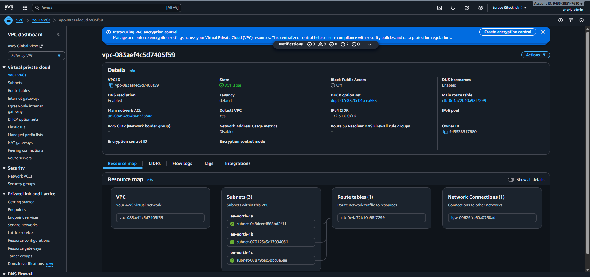
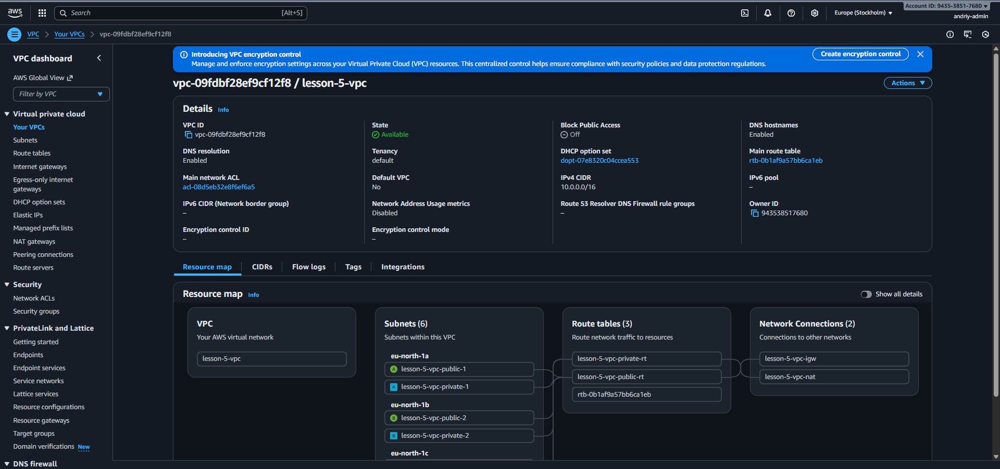
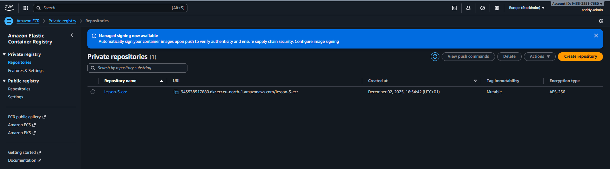
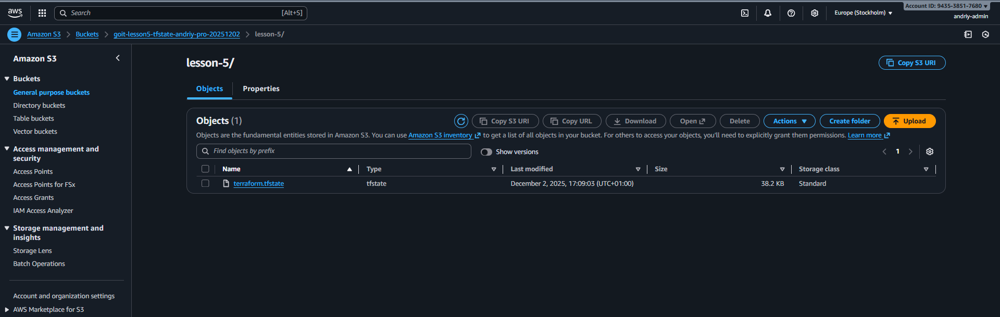

# Lesson 5: AWS Infrastructure with Terraform

Terraform-проєкт для створення базової AWS інфраструктури:

- **S3 + DynamoDB** — зберігання та блокування Terraform state
- **VPC** — ізольована мережа з 3 публічними та 3 приватними підмережами
- **ECR** — приватний Docker registry

## Структура проєкту

```
lesson-5/
├── main.tf              # Підключення модулів
├── backend.tf           # S3 backend (спочатку закоментований)
├── outputs.tf           # Вихідні значення
├── providers.tf         # AWS provider
├── .terraform.lock.hcl  # Версії провайдерів (має бути в Git!)
└── modules/
    ├── s3-backend/      # S3 bucket + DynamoDB table
    ├── vpc/             # VPC, subnets, IGW, NAT, routes
    └── ecr/             # ECR repository
```

> 📌 **Про `.terraform.lock.hcl`:** Цей файл фіксує версії провайдерів і **має
> бути в Git** для консистентності в команді. Див.
> [HashiCorp docs](https://developer.hashicorp.com/terraform/language/files/dependency-lock)

## Git

Робота ведеться в гілці `lesson-5`:

```bash
git checkout main
git checkout -b lesson-5
```

## Швидкий старт

### 1. Підготовка

```bash
# Перевірка авторизації AWS
aws sts get-caller-identity

# Якщо помилка — налаштуй AWS CLI
aws configure
```

### 2. Локальне тестування з LocalStack (опціонально)

**LocalStack** — емулятор AWS на твоєму комп'ютері. Дозволяє тестувати Terraform
код безкоштовно.

```bash
# Встановлення (потрібен Docker)
docker pull localstack/localstack

# Запуск
docker run -d --name localstack -p 4566:4566 \
  -e SERVICES=s3,dynamodb,ec2,ecr localstack/localstack

# Перевірка
curl http://localhost:4566/_localstack/health
```

Для роботи з LocalStack потрібен окремий `providers_local.tf`:

```hcl
provider "aws" {
  region                      = "eu-north-1"
  access_key                  = "test"
  secret_key                  = "test"
  skip_credentials_validation = true
  skip_metadata_api_check     = true

  endpoints {
    s3       = "http://localhost:4566"
    dynamodb = "http://localhost:4566"
    ec2      = "http://localhost:4566"
    ecr      = "http://localhost:4566"
  }
}
```

> ⚠️ LocalStack не підтримує NAT Gateway повністю. Використовуй для базової
> перевірки S3, DynamoDB, ECR.

### 3. Deploy в AWS

```bash
cd lesson-5

# Ініціалізація (завантажує провайдери)
terraform init

# Перевірка синтаксису
terraform validate

# Перегляд плану (що буде створено)
terraform plan

# Створення ресурсів (⚠️ NAT Gateway платний!)
terraform apply
# Введи: yes
```

### 4. Міграція state в S3

**Проблема "курка чи яйце":** Щоб зберігати state в S3, потрібен S3 bucket. Але
bucket створюється через Terraform. Хто перший?

**Рішення:**

1. Спочатку `backend.tf` закоментований → state зберігається локально
2. `terraform apply` створює S3 bucket
3. Розкоментовуємо `backend.tf`, вказуємо ім'я створеного bucket
4. `terraform init -migrate-state` переносить state в S3

```bash
# Після успішного apply:
terraform init -migrate-state
# Введи: yes
```

### 5. Видалення ресурсів

> ⚠️ **ВАЖЛИВО:** NAT Gateway коштує ~$1.08/день. Видаляй одразу після
> тестування!

**Правильний порядок (якщо використовуєш S3 backend):**

```bash
# 1. Закоментуй блок backend "s3" {...} в backend.tf

# 2. Мігруй state з S3 на локальний диск
terraform init -migrate-state
# Введи: yes (на запитання про копіювання state)

# 3. Тепер можна безпечно видаляти ресурси
terraform destroy
```

> 💡 Чому такий порядок? Якщо спочатку видалити S3 bucket, Terraform не зможе
> зберегти оновлений state і видасть помилку "NoSuchBucket".

**Швидкий спосіб (якщо state локальний):**

```bash
terraform destroy
```

## Команди Terraform

| Команда                | Призначення             | Змінює AWS? |
| ---------------------- | ----------------------- | ----------- |
| `terraform init`       | Завантажує провайдери   | ❌          |
| `terraform validate`   | Перевіряє синтаксис     | ❌          |
| `terraform fmt`        | Форматує код            | ❌          |
| `terraform plan`       | Показує план змін       | ❌          |
| `terraform apply`      | Створює ресурси         | ✅          |
| `terraform destroy`    | Видаляє ресурси         | ✅          |
| `terraform state list` | Показує ресурси в state | ❌          |

## Типові помилки та їх вирішення

### 1. "NoSuchBucket" при terraform destroy

**Симптом:**

```
Error: failed to upload state: api error NoSuchBucket: The specified bucket does not exist
Error: Failed to persist state to backend
```

**Причина:** `terraform destroy` видалив S3 bucket до збереження state.

**Рішення:**

```bash
# 1. Перевір, чи видалені платні ресурси (NAT Gateway)
aws ec2 describe-nat-gateways --filter "Name=state,Values=available,pending"

# 2. Видали локальні файли state (НЕ видаляй .terraform.lock.hcl!)
rm -f errored.tfstate errored.tfstate.backup
rm -f terraform.tfstate terraform.tfstate.backup
rm -rf .terraform

# 3. Закоментуй backend в backend.tf

# 4. Переініціалізуй
terraform init
```

**Якщо VPC залишився:**

```bash
# Перевірка
aws ec2 describe-vpcs --filters "Name=tag:Name,Values=lesson-5-vpc"

# Ручне видалення (якщо terraform не може)
# AWS Console → VPC → Delete VPC
```

### 2. "Access Denied" або "InvalidClientTokenId"

**Симптом:**

```
Error: error configuring Terraform AWS Provider: error validating provider credentials
```

**Причина:** AWS CLI не налаштований або credentials невалідні.

**Рішення:**

```bash
# Перевірка
aws sts get-caller-identity

# Якщо помилка — налаштуй заново
aws configure
# Введи Access Key ID, Secret Access Key, Region (eu-north-1)
```

### 3. "bucket already exists"

**Симптом:**

```
Error: creating Amazon S3 Bucket: BucketAlreadyExists
```

**Причина:** S3 bucket names глобально унікальні.

**Рішення:** Зміни `bucket_name` в `main.tf` на унікальне значення. Використай
своє ім'я та/або дату:

```hcl
bucket_name = "goit-lesson5-tfstate-ivanov-20241201"
```

### 4. "Error acquiring the state lock"

**Симптом:**

```
Error: Error acquiring the state lock
Lock Info: ID: cabb7ee1-00e2-7845-10ec-6769eb76f448
```

**Причина:** Попередній процес не зняв блокування.

**Рішення:**

```bash
terraform force-unlock LOCK_ID
# Наприклад: terraform force-unlock cabb7ee1-00e2-7845-10ec-6769eb76f448
```

### 5. Terraform команди не працюють

**Симптом:** `terraform: command not found`

**Рішення:**

```bash
# Встановлення Terraform (Ubuntu/WSL)
wget -O- https://apt.releases.hashicorp.com/gpg | sudo gpg --dearmor -o /usr/share/keyrings/hashicorp-archive-keyring.gpg
echo "deb [signed-by=/usr/share/keyrings/hashicorp-archive-keyring.gpg] https://apt.releases.hashicorp.com $(lsb_release -cs) main" | sudo tee /etc/apt/sources.list.d/hashicorp.list
sudo apt update && sudo apt install terraform -y
```

## Перевірка ресурсів в AWS

```bash
# VPC
aws ec2 describe-vpcs --filters "Name=tag:Name,Values=lesson-5-vpc"

# NAT Gateway (платний!)
aws ec2 describe-nat-gateways --filter "Name=state,Values=available,pending"

# ECR
aws ecr describe-repositories --repository-names lesson-5-ecr

# S3 bucket
aws s3 ls | grep lesson5

# DynamoDB
aws dynamodb list-tables
```

## Вартість

| Ресурс                    | Вартість                      |
| ------------------------- | ----------------------------- |
| VPC, Subnets, IGW, Routes | Безкоштовно                   |
| S3 (state file)           | Free Tier                     |
| DynamoDB (locks)          | Free Tier                     |
| ECR                       | Free Tier (до 500MB)          |
| **NAT Gateway**           | **~$0.045/год (~$1.08/день)** |

> 💡 Завжди виконуй `terraform destroy` після тестування!

## Корисні посилання

- [Terraform AWS Provider](https://registry.terraform.io/providers/hashicorp/aws/latest/docs)
- [AWS Free Tier](https://aws.amazon.com/free/)
- [LocalStack](https://localstack.cloud/)

## Скріншоти виконаної роботи

### VPC Dashboard



_Створений VPC `lesson-5-vpc` з CIDR block `10.0.0.0/16`_

### Subnets



_3 публічні та 3 приватні підмережі в різних Availability Zones_

### ECR Repository



_Docker registry `lesson-5-ecr` для зберігання контейнерів_

### S3 Bucket (Terraform State)



_S3 bucket для зберігання Terraform state_
